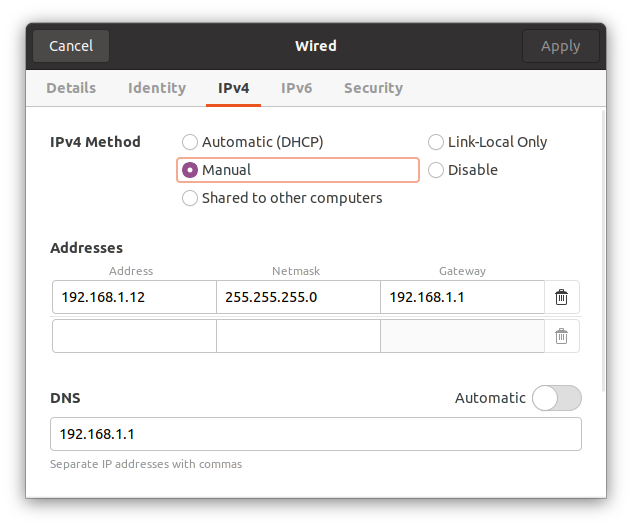

# Teleoperation Example for xArm7

The code is based on `python>=3.9`.

## Teleoperation Devices

### SpaceMouse

**3Dconnexion® SpaceMouse Compact**:


Do not install the proprietary driver on Linux (<https://github.com/ARISE-Initiative/robosuite/issues/434>).
You might not need to install additional driver on Linux. If needed, you can try [spacenav](https://spacenav.sourceforge.net/): `sudo apt-get install libspnav-dev`.
You can try to check whether the spacemouse is detected by `grep 3Dconnexion /proc/bus/input/devices`.

We will use `hidapi` to read data from the device.

```bash
pip install hidapi
```

To avoid `sudo` permission, you need to configure `udev` rules:

```bash
# Add udev rule
echo 'SUBSYSTEM=="usb", ATTRS{idVendor}=="256f", MODE="0666", GROUP="plugdev"' | sudo tee /etc/udev/rules.d/99-my-device.rules
# Check the option by `udevadm control -h` first
sudo udevadm control --reload
```

To test whether your setup works, you can run `python devices/spacemouse.py`.

References:

- <https://wiki.archlinux.org/title/3D_Mouse>
- [Manual](https://3dconnexion.com/manuals/spacemouse-compact/en/Manual_3Dconnexion-SpaceMouse-Compact_EN.pdf)
- [cython-hidapi](https://github.com/trezor/cython-hidapi)
- [udev rule example](https://stackoverflow.com/questions/50322382/python-hidapi-troubleshooting-open-failures)
- [Deoxys guidance](https://ut-austin-rpl.github.io/deoxys-docs/html/tutorials/using_teleoperation_devices.html)
- [robottranconteur guidance](https://github.com/robotraconteur-contrib/robotraconteur_spacemouse_evdev_driver)

## xArm7

**\[Important\]You must always be prepared to press the emergency button!**

<details>
<summary>Connect to the xArm via Ethernet</summary>

> To connect with Ethernet, please check if the computer's IP addressis 192.168.1.\*, check if the network proxy is enabled, and check ifthe robotic arm’s IP address conflicts with that of other devicesinthe LAN. Please change the computer IP address to the same networksegment and close the computer's network proxy. To test whether thecomputer can communicate with the robotic arm, open the command terminal and input ‘ping 192.168.1.\* (the IP address of the roboticarm)’. If the ping is working, the communication between the computer and the robotic arm is successful.



</details>

References:

- [xArm User Manual](https://www.ufactory.cc/wp-content/uploads/2024/02/xArm-User-Manual-V2.3.0.pdf)
- [Example network configuration](https://forum.ufactory.cc/t/computer-ip-configuration/2530)

## System Identification

https://github.com/HillbotAI/xarm7-control/assets/17827258/37d1517e-80e5-462f-99c2-a7e191dc7ed2

